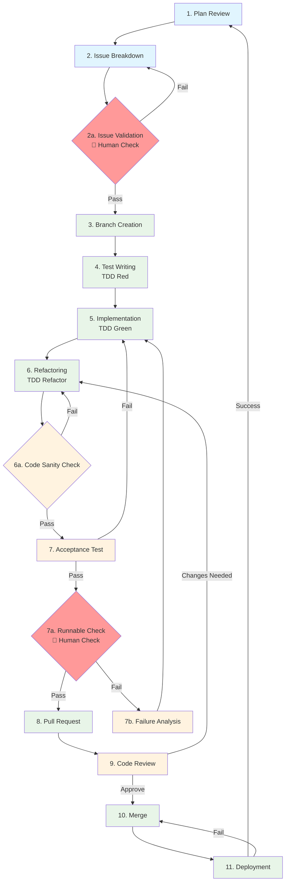

# 🌊 Vibe Coding Framework

**Where humans set the vision, and AI handles the implementation.**

日本語での対話を歓迎します！ / Japanese conversations are welcome!

## 📖 概要

Vibe Coding Frameworkは、AI駆動開発手法の新しいアプローチです。人間が戦略的な意思決定に集中し、AIが実装の詳細を自動化する、厳格な役割分離と11ステップの開発サイクルを特徴としています。

## 🎯 主要な特徴

### ✨ 明確なワークフロー
- **11ステップの構造化された開発サイクル**
- **2つの人間チェックポイント**のみ（Issue検証、機能テスト）
- **TDD原則**に基づく自動実装プロセス

### 🤖 Subagent自動切り替え
- **4つの専用Subagent**による役割ベース実行
- **自動的な権限切り替え**とコンテクスト管理
- **厳格なアクセス制御**による品質保証

### 🔐 厳密な権限管理
- **役割ごとのコンテクストアクセス権限**（Read/Edit/Create）
- **人間はコード非表示**の設計思想
- **各Subagentの責任範囲**を明確に分離

## 🔄 開発ワークフロー



### 🚩 凡例
- �� **Product Manager** (Planning)
- 🟢 **Engineer** (Implementation)
- 🟠 **QA Engineer** (Quality Assurance)
- 🔴 **Human** (Strategic Checkpoints)

## 📋 詳細ワークフロー定義

### Planning Phase (自動実行)
```yaml
1_plan_review:
  role: product_manager
  mission: "Review progress and update development plan"
  context:
    read: [vision, spec, plan]
    edit: [plan]
    create: []

2_issue_breakdown:
  role: product_manager
  mission: "Create issues for next sprint/iteration"
  context:
    read: [vision, spec, plan]
    edit: []
    create: [issues]

2a_issue_validation:
  role: human
  mission: "Validate issues are clear and implementable (Human checkpoint)"
  context:
    read: [issues]
    edit: []
    create: []
  condition:
    pass: 3_branch_creation
    fail: 2_issue_breakdown
```

### Implementation Phase (自動実行)
```yaml
3_branch_creation:
  role: engineer
  mission: "Create feature branch for the issue"
  context:
    read: [issues]
    edit: []
    create: []

4_test_writing:
  role: engineer
  mission: "Write tests and confirm they fail (TDD Red)"
  context:
    read: [issues]
    edit: []
    create: [code]

5_implementation:
  role: engineer
  mission: "Implement minimal code to pass tests (TDD Green)"
  context:
    read: [issues, code]
    edit: [code]
    create: [code]

6_refactoring:
  role: engineer
  mission: "Improve code quality (TDD Refactor)"
  context:
    read: [issues, code]
    edit: [code]
    create: []

6a_code_sanity_check:
  role: qa_engineer
  mission: "Run automated checks for obvious bugs or issues"
  context:
    read: [code]
    edit: []
    create: []
  condition:
    pass: 7_acceptance_test
    fail: 6_refactoring
```

### Validation Phase
```yaml
7_acceptance_test:
  role: qa_engineer
  mission: "Verify issue requirements are met"
  context:
    read: [spec, issues, code]
    edit: []
    create: []
  condition:
    pass: 7a_runnable_check
    fail: 5_implementation

7a_runnable_check:
  role: human
  mission: "Manually test the feature works as expected (Human checkpoint)"
  context:
    read: [issues]
    edit: []
    create: []
  condition:
    pass: 8_pull_request
    fail: 7b_failure_analysis

7b_failure_analysis:
  role: qa_engineer
  mission: "Analyze why requirements weren't met"
  context:
    read: [issues, code]
    edit: []
    create: []
  next: 5_implementation
```

### Deployment Phase (自動実行)
```yaml
8_pull_request:
  role: engineer
  mission: "Create PR and request review"
  context:
    read: [issues, code]
    edit: []
    create: []

9_review:
  role: qa_engineer
  mission: "Review code quality and compliance"
  context:
    read: [issues, code]
    edit: []
    create: []
  condition:
    approve: 10_merge
    request_changes: 6_refactoring

10_merge:
  role: engineer
  mission: "Merge approved changes to main branch"
  context:
    read: [code]
    edit: []
    create: []

11_deployment:
  role: engineer
  mission: "Deploy to staging/production environment"
  context:
    read: [code]
    edit: []
    create: []
  condition:
    success: 1_plan_review
    fail: 10_merge
```

## 🗂️ コンテクスト定義

### Core Documents
```yaml
vision:
  description: "Product vision - what you want to build"
  format: "Markdown document"
  created_by: "Human (initial phase)"
  example: |
    # Product Vision
    ## Problem to solve
    ## Target users
    ## Value proposition

spec:
  description: "Functional requirements, specifications, and technical design"
  format: "Markdown document"
  created_by: "Human (initial phase)"
  example: |
    # Specification Document
    ## Functional requirements
    ## Non-functional requirements
    ## Technical stack
    ## Architecture
    ## Constraints

plan:
  description: "Development plan and progress tracking"
  format: "Markdown document"
  created_by: "Human (initial phase)"
  updated_by: "product_manager (step_1)"
  example: |
    # Development Plan
    ## Milestones
    ## TODO List
    ## Completed items
    ## Next sprint plan

issues:
  description: "Implementation task list"
  format: "GitHub Issues / Markdown"
  created_by: "product_manager (step_2)"
  example: |
    ## Title
    ## Overview
    ## Acceptance criteria
    ## Technical details

code:
  description: "Source code (including implementation and tests)"
  format: "Programming language files"
  created_by: "engineer (step_4, step_5)"
  updated_by: "engineer (step_5, step_6)"
  note: "No distinction between test code and implementation code"
```

## 🎭 役割とアクセス権限

### Product Manager
```yaml
access_rights:
  read: [vision, spec, plan]  # MUST read ALL before creating issues
  edit: [plan]
  create: [issues]
responsibility:
  - プロジェクト進捗の把握
  - 開発計画の更新
  - 実装可能なIssueの作成
```

### Engineer  
```yaml
access_rights:
  read: [issues, code]  # MUST read issues carefully before implementing
  edit: [code]
  create: [code]
responsibility:
  - TDDプロセスの実行
  - 品質の高いコード実装
  - テストとリファクタリング
```

### QA Engineer
```yaml
access_rights:
  read: [spec, issues, code]  # MUST verify against spec
  edit: []
  create: []
responsibility:
  - 要件との整合性確認
  - コード品質レビュー
  - 自動テストの実行
```

### Human
```yaml
access_rights:
  read: [issues]  # Reviews issues only, no code access
  edit: []
  create: []
responsibility:
  - Issue内容の妥当性判断
  - 機能の動作確認
  - 戦略的意思決定
```

## 🚀 使い方

### 1. 初期セットアップ
```bash
# リポジトリをクローン
git clone https://github.com/mizkun/vibeflow.git
cd vibeflow

# セットアップスクリプトを実行
./setup_vibeflow.sh
```

### 2. プロジェクト設定
以下のファイルを編集してプロジェクトの詳細を記入：

- **`vision.md`** - プロダクトビジョンと目標
- **`spec.md`** - 機能要件と技術仕様
- **`plan.md`** - 開発計画とマイルストーン

### 3. 開発サイクル開始
Claude Codeでプロジェクトを開き、日本語で指示：

```
「開発サイクルを開始して」
```

### 4. 利用可能なコマンド
- `/progress` - 現在の進捗確認
- `/healthcheck` - 整合性チェック
- `/abort` - 緊急停止
- `/next` - 次のステップへ
- `/vibe-status` - 設定確認

## 📁 プロジェクト構造

```
/
├── .claude/
│   ├── agents/              # Subagentファイル
│   │   ├── pm-auto.md      # Product Manager
│   │   ├── engineer-auto.md # Engineer
│   │   ├── qa-auto.md      # QA Engineer
│   │   └── deploy-auto.md  # Deployment
│   └── commands/           # スラッシュコマンド
├── .vibe/
│   ├── state.yaml          # 現在のサイクル状態
│   └── templates/          # Issueテンプレート
├── issues/                 # 実装タスク
├── src/                   # ソースコード
├── vision.md              # プロダクトビジョン
├── spec.md               # 仕様書
├── plan.md               # 開発計画
├── CLAUDE.md             # フレームワーク文書
└── setup_vibeflow.sh     # セットアップスクリプト
```

## 🔄 自動実行の仕組み

### Phase 1: Planning (自動)
1. **Plan Review** → **Issue Creation** → 🛑 **Human Validation**

### Phase 2: Implementation (自動)
2. **Branch** → **Tests** → **Code** → **Refactor** → **QA Check**

### Phase 3: Validation
3. **Acceptance Test** → 🛑 **Human Testing** → **Failure Analysis**

### Phase 4: Deployment (自動)
4. **PR** → **Review** → **Merge** → **Deploy**

## ⚠️ 重要な原則

### 🚫 禁止事項
- **人間はコードを直接確認しない**
- **役割の境界を越えたファイルアクセス**
- **手動でのステップスキップ**

### ✅ 推奨事項
- **TDD原則の厳格な遵守**
- **人間チェックポイントでの慎重な判断**
- **自動化プロセスへの信頼**

## 🎯 設計哲学

> **"Vibe Coding: Where humans set the vision, and AI handles the implementation."**

- **人間**: ビジョン設定、戦略的判断、最終確認
- **AI**: 詳細実装、品質管理、プロセス自動化

## 🤝 貢献

このフレームワークの改善にご協力ください：

1. Issue の作成
2. Pull Request の送信
3. フィードバックの提供

## 📜 ライセンス

MIT License

---

**🌊 Happy Vibe Coding!**

*人間がビジョンを描き、AIが実装する新しい開発の時代へ*
