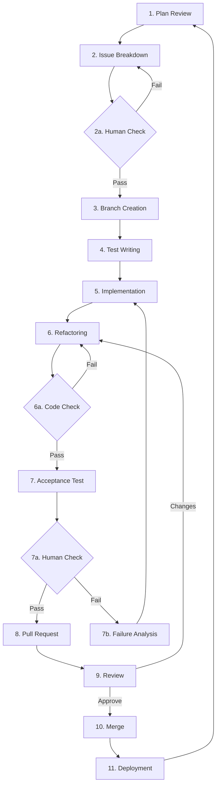

# Vibe Coding Framework アーキテクチャ

## 概要

Vibe Coding Frameworkは、AI駆動の開発方法論を実現するためのアーキテクチャです。役割の分離、自動化されたワークフロー、人間の介入を最小限に抑えることで、効率的な開発プロセスを実現します。

## コアコンセプト

### 1. 役割ベースのアクセス制御

フレームワークは4つの役割を定義し、それぞれに明確なアクセス権限を設定します：

```yaml
roles:
  product_manager:
    can_read: [vision, spec, plan]
    can_edit: [plan]
    can_create: [issues]
    
  engineer:
    can_read: [issues, code]
    can_edit: [code]
    can_create: [code]
    
  qa_engineer:
    can_read: [spec, issues, code]
    can_edit: []
    can_create: []
    
  human:
    can_read: [issues]
    can_edit: []
    can_create: []
```

### 2. コンテキストの分離

各コンテキストは特定の情報を含み、役割によってアクセスが制限されます：

- **vision**: プロダクトビジョン（読み取り専用）
- **spec**: 仕様と技術設計（読み取り専用）
- **plan**: 開発計画（PMのみ編集可）
- **issues**: 実装タスク（PMが作成、エンジニアが読み取り）
- **code**: ソースコード（エンジニアのみアクセス可）

### 3. 11ステップの開発サイクル



## 技術アーキテクチャ

### ディレクトリ構造

```
project/
├── .claude/                # Claude Code設定
│   ├── agents/            # Subagent定義
│   │   ├── pm-auto.md
│   │   ├── engineer-auto.md
│   │   ├── qa-auto.md
│   │   └── deploy-auto.md
│   └── commands/          # スラッシュコマンド
│       ├── progress.md
│       ├── healthcheck.md
│       └── ...
├── .vibe/                 # フレームワーク状態
│   ├── state.yaml        # 現在のサイクル状態
│   └── templates/        # Issueテンプレート
├── issues/               # 実装タスク
├── src/                  # ソースコード
└── *.md                  # ドキュメント
```

### 状態管理

`.vibe/state.yaml`でサイクルの状態を管理：

```yaml
current_cycle: 3
current_step: 5_implementation
current_issue: "issue-042-user-authentication"
next_step: 6_refactoring
checkpoint_status:
  2a_issue_validation: passed
  7a_runnable_check: pending
```

### Subagentアーキテクチャ

各Subagentは特定の役割とツールセットを持ちます：

1. **pm-auto**
   - ツール: file_view, file_edit, str_replace_editor
   - 責任: 計画レビュー、Issue作成

2. **engineer-auto**
   - ツール: file_view, file_edit, str_replace_editor, run_command, browser
   - 責任: 実装、テスト作成、リファクタリング

3. **qa-auto**
   - ツール: file_view, run_command, str_replace_editor
   - 責任: 品質チェック、受け入れテスト

4. **deploy-auto**
   - ツール: file_view, run_command, browser
   - 責任: PR作成、マージ、デプロイ

## セキュリティとアクセス制御

### 原則

1. **最小権限の原則**: 各役割は必要最小限のアクセス権のみを持つ
2. **読み取り専用ドキュメント**: vision.mdとspec.mdは開発中は変更不可
3. **人間のコード非アクセス**: 人間はソースコードに直接アクセスできない

### 実装

- ファイルシステムレベルでの制御ではなく、AIの指示による制御
- 各Subagentは許可されたファイルのみアクセス
- state.yamlで現在の役割と権限を追跡

## 自動化フロー

### トリガーと遷移

1. **自動遷移**: 人間以外のステップは自動的に次へ進行
2. **条件分岐**: テスト結果やレビュー結果に基づく分岐
3. **ループバック**: 失敗時は適切なステップに戻る

### 並列処理

可能な場合、複数のタスクを並列実行：
- 複数のIssueを並列で作成
- テストと実装の反復を効率化

## 拡張性

### カスタムSubagentの追加

新しいSubagentを追加する場合：

```markdown
---
name: custom-agent
description: "カスタムエージェントの説明"
tools: file_view, custom_tool
---

# エージェントの詳細な説明とルール
```

### ワークフローのカスタマイズ

`.vibe/workflow.yaml`で独自のワークフローを定義可能（将来実装予定）

## パフォーマンス考慮事項

1. **コンテキストサイズ**: 各Subagentは必要なファイルのみ読み込み
2. **状態の永続化**: state.yamlで進捗を保存し、中断からの再開が可能
3. **エラーリカバリ**: 各ステップでエラーハンドリングを実装

## 今後の拡張予定

1. **マルチプロジェクト対応**: 複数プロジェクトの並列管理
2. **カスタムワークフロー**: YAMLによるワークフロー定義
3. **メトリクス収集**: 開発効率の測定と改善
4. **プラグインシステム**: カスタムツールとSubagentの追加